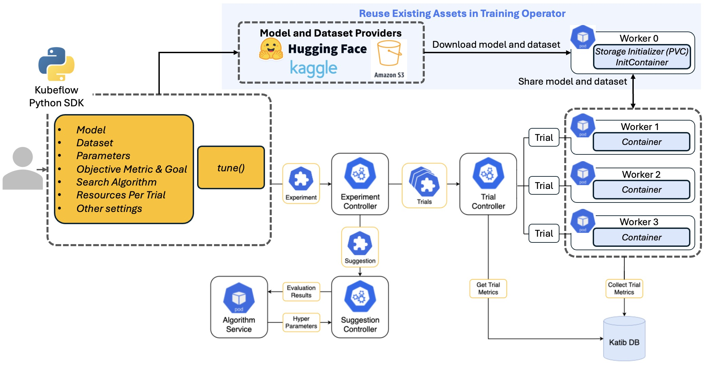

# HyperParameter Optimization API for LLM Fine-Tuning

- [HyperParameter Optimization API for LLM Fine-Tuning](#hyperparameter-optimization-api-for-llm-fine-tuning)
  * [Links](#links)
  * [Motivation](#motivation)
  * [Goal](#goal)
  * [Design for API](#design-for-api)
    + [Example](#example)
  * [Implementation](#implementation)
  * [Advanced Functionalities](#advanced-functionalities)

## Links

- [katib/issues#2291 (Tuning API in Katib for LLMs)](https://github.com/kubeflow/katib/issues/2291)

## Motivation

The rapid advancements and growing popularity of Large Language Models (LLMs) have driven an increased need for effective LLMOps in Kubernetes environments. To address this, we developed a [train API](https://www.kubeflow.org/docs/components/training/user-guides/fine-tuning/) within the Training Python SDK, simplifying the process of fine-tuning LLMs using distributed PyTorchJob workers. However, hyperparameter optimization remains a crucial yet labor-intensive task for enhancing model performance. Automating this tuning process through a dedicated API will facilitate efficient and scalable exploration of hyperparameters, ultimately improving model performance and reducing manual effort.

## Goal

Our goal is to develop a high-level API for tuning hyperparameters of LLMs that simplifies the process of hyperparameter optimization in Kubernetes. This API will seamlessly integrate with external platforms like HuggingFace and S3 for importing pretrained models and datasets. By specifying parameters for the training objective, trial configurations, and PyTorch worker configurations, the API will automate the creation of experiments and execution of trials. This abstraction of Kubernetes infrastructure complexities will enable data scientists to optimize hyperparameters efficiently and effectively.

## Design for API



```python
import kubeflow.katib as katib
from kubeflow.katib import KatibClient

class KatibClient(object):
	
	def tune(
		name: str, 
		namespace: Optional[str] = None,
		model_provider_parameters = None,
		dataset_provider_parameters = None,
		trainer_parameters = None,
		algorithm_name: str = "random",
		algorithm_settings: Union[dict, List[models.V1beta1AlgorithmSetting], None] = None,
		objective_metric_name: str = "eval_accuracy",
		additional_metric_names: List[str] = [],
		objective_type: str = "maximize",
		objective_goal: float = None,
		max_trial_count: int = None,
		parallel_trial_count: int = None,
		max_failed_trial_count: int = None,
		resources_per_trial: Union[dict, client.V1ResourceRequirements, None] = None,
		pytorch_config=katib.PyTorchConfig(
			num_workers: int = 1,
			num_procs_per_worker: int = 1,
		),
		retain_trials: bool = False,
		env_per_trial: Optional[Union[Dict[str, str], List[Union[client.V1EnvVar, client.V1EnvFromSource]]]] = None,
		packages_to_install: List[str] = None,
		pip_index_url: str = "https://pypi.org/simple",
	):
		"""
        Initiates a hyperparameter tuning experiment in Katib.

        Parameters:
        - name: Name for the experiment.
		- namespace: Namespace for the experiment. Defaults to the namespace of the 'KatibClient' object.
		- model_provider_parameters: Parameters for providing the model. Compatible with model providers like HuggingFace.
    	- dataset_provider_parameters: Parameters for providing the dataset. Compatible with dataset providers like HuggingFace or S3.
    	- trainer_parameters: Parameters for configuring the training process, including settings for hyperparameters search space.
		- algorithm_name: Tuning algorithm name (e.g., 'random', 'bayesian').
		- algorithm_settings: Settings for the tuning algorithm.
        - objective_metric_name: Primary metric to optimize.
		- additional_metric_names: List of additional metrics to collect.
        - objective_type: Optimization direction for the objective metric, "minimize" or "maximize".
		- objective_goal: Desired value of the objective metric.
        - max_trial_count: Maximum number of trials to run.
        - parallel_trial_count: Number of trials to run in parallel.
		- max_failed_trial_count: Maximum number of allowed failed trials.
        - resources_per_trial: Resources required per trial.
		- pytorch_config: Configuration for PyTorch jobs, including number of workers and processes per worker.
        - retain_trials: Whether to retain trial resources after completion.
		- env_per_trial: Environment variables for worker containers.
        - packages_to_install: Additional Python packages to install.
        - pip_index_url: URL of the PyPI index for installing packages.
        """
        pass  # Implementation logic for initiating the experiment
```

### Example

```python
import transformers
from peft import LoraConfig

from kubeflow.storage_initializer.hugging_face import (
	HuggingFaceModelParams,
	HuggingFaceDatasetParams,
	HuggingFaceTrainerParams,
)

import kubeflow.katib as katib
from kubeflow.katib import KatibClient

# Create a Katib client
katib_client = KatibClient(namespace='kubeflow')

# Run the tuning Experiment
exp_name = "llm-hp-optimization-test"
katib_client.tune(
	name = exp_name,
	# BERT model URI and type of Transformer to train it.
	model_provider_parameters = HuggingFaceModelParams(
		model_uri = "hf://google-bert/bert-base-cased",
		transformer_type = transformers.AutoModelForSequenceClassification,
	),
	# Use 3000 samples from Yelp dataset.
	dataset_provider_parameters = HuggingFaceDatasetParams(
		repo_id = "yelp_review_full",
		split = "train[:3000]",
	),
	# Specify HuggingFace Trainer parameters.
	trainer_parameters = HuggingFaceTrainerParams(
		training_parameters = transformers.TrainingArguments(
			output_dir = "test_trainer",
			save_strategy = "no",
			eval_strategy = "epoch",
			disable_tqdm = True,
			log_level = "info",
			learning_rate = katib.search.double(min=1e-05, max=5e-05),
			per_device_train_batch_size = katib.search.int(min=8, max=64),
			num_train_epochs = katib.search.int(min=1, max=10),
			weight_decay = katib.search.double(min=0.0, max=1.0),
		),
		# Set LoRA config to reduce number of trainable model parameters.
		lora_config = LoraConfig(
			r = katib.search.int(min=8, max=32),
			lora_alpha = 8,
			lora_dropout = 0.1,
			bias = "none",
		),
	),	
	objective_metric_name = "eval_accuracy", 
	objective_type = "maximize", 
	algorithm_name = "random",
	max_trial_count = 50,
	parallel_trial_count = 2,
	resources_per_trial = {
		"gpu": 8,
		"cpu": 20,
		"memory": "40G",
	},
	num_workers = 4,
	num_procs_per_worker = 2,
)

# Get the best hyperparameters
best_hps = katib_client.get_optimal_hyperparameters(exp_name)
```

## Implementation

By passing the specified parameters, the `tune` function will automate hyperparameter optimization for LLMs. The implementation focuses on two parts:

**Model and Dataset Downloading**: We will leverage the [storage_initializer](https://github.com/kubeflow/training-operator/tree/master/sdk/python/kubeflow/storage_initializer) defined in the Training Python SDK for seamless integration of pretrained models and datasets from platforms like HuggingFace and S3. It will manage downloading and storing pretrained models and datasets via a PersistentVolumeClaim (PVC). This volume will be shared across containers, ensuring efficient access to the pretrained model and dataset without redundant downloads.

**Experiment and Trial Configuration**: Similar to the [existing tune API](https://github.com/kubeflow/katib/blob/0d190b94373c2f8f6150bf17d6dfa3698f4b2961/sdk/python/v1beta1/kubeflow/katib/api/katib_client.py#L152), we will create an experiment that defines the objective metric, search space, optimization algorithm, etc. The Experiment orchestrates the hyperparameter optimization process, including generating Trials, tracking their results, and identifying the optimal hyperparameters. Each Trial, implemented as a Kubernetes PyTorchJob, runs model training with specific hyperparameters. In the Trial specification for PyTorchJob, we will define the init container, master, and worker containers, allowing effective distribution across workers. Trial results will be fed back into the Experiment for evaluation, which then generates new Trials to further explore the hyperparameter space or concludes the tuning process.

## Advanced Functionalities

1. Incorporate early stopping strategy into the API to optimize training efficiency.
2. Expand support for distributed training in frameworks beyond PyTorch by leveraging their distributed training capabilities.
3. Support adding custom providers through configmap or CRD approach to enhance flexibility.
4. Enable users to deploy tuned models for inference within their applications or seamlessly integrate them into existing NLP pipelines for specialized tasks.

_#WIP_